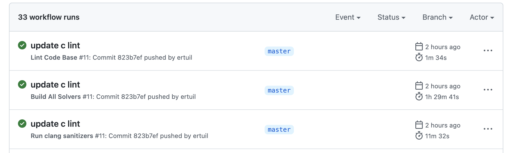

# Fuzzing a Software Verifier

## Introduction

[ESBMC](http://www.esbmc.org/) is an SMT-based code analyzer for single (multiple) thread C/C++ programs. It can leverage multiple solvers, including Z3, CVC4, boolector, etc. ESBMC can be used to find vulnerabilities or perform checks, like memory leak check, deadlock check, and other checks.

Fuzzing is a new software testing method to randomly generate a batch of input trying to crash the software. It is an automatic analysis method to quickly find vulnerabilities in software. Among multiple implements, [libFuzzer](https://llvm.org/docs/LibFuzzer.html) is a state-of-the-art fuzzing module and is a part of the LLVM project.

In this task, I implemented a fuzzing framework on top of ESBMC by introducing libFuzzer. I first design new options in the ESBMC program to enable fuzzing and then compile a corresponding fuzzing program by calling libFuzzer. Then, we run the fuzzing test in one step to find vulnerabilities.

## File Structures

In this directory, `Readme.md` and `Readme.pdf` are the reports of this task. The test codes and the corresponding results are located in the `test` directory. `Script` directory contains codes to compile `esbmc ` and run the fuzzing test. Finally, `ESBMC_Project` contains the modified C++ codes (without Clang11), and `bin` contains the compiled binary file in both Darwin and Linux platforms.

## Approaches

My experiment is implemented on a Macbook Pro. Then, I re-compile the modified ESBMC in an Ubuntu virtual machine. Finally, I integrate ESBMC's CI/CD (GitHub Actions) to confirm that our codes can be run on Windows, Linux, and Darwin environments.

### Install ESBMC from source code

First, I need to install the ESBMC platform from the source code. I followed the instructions of [ESBMC](https://github.com/esbmc/esbmc/blob/master/BUILDING.md). I used the following commands to setup dependents, download ESBMC:

``` bash
brew install gmp cmake boost ninja python3 automake && pip3 install PySMT
mkdir ESBMC_Project && cd ESBMC_Project && git clone https://github.com/esbmc/esbmc
```

Then, I download the clang 11 as a dependent. Note that clang provided by MacOS natively does not have libFuzzer included.

``` bash
tar xJf clang+llvm-11.0.0-x86_64-apple-darwin.tar.xz && mv clang+llvm-11.0.0-x86_64-apple-darwin clang11
```

Since we do not need to modify the SMT part of ESBMC and also do not need to deal with solidity, I do not compile any solvers at first. I can start compiling ESBMC using the following commands:

``` bash
cmake .. -GNinja -DBUILD_TESTING=On -DENABLE_REGRESSION=On -DBUILD_STATIC=On -DClang_DIR=$PWD/../../clang11 -DLLVM_DIR=$PWD/../../clang11 -DC2GOTO_SYSROOT=/Library/Developer/CommandLineTools/SDKs/MacOSX.sdk  -DCMAKE_INSTALL_PREFIX:PATH=$PWD/../../release

cmake --build . && ninja install
```

Now, the unmodified version of ESBMC should be compiled successfully.

### Integrating libFuzzer

To enable ESBMC with fuzzing test, I need to enlarge options of ESBMC, I increase the following options:

``` bash
$  ./ESBMC_Project/ESBMC_Project/release/bin/esbmc --help

* * *           ESBMC 6.9.0          * * *

Main Usage:
  --input-file file.c ...         source file names

Options:
  -? [ --help ]                   show help

Fuzzing:
  --fuzz                          use libFuzzing to fuzzing
  --fuzz-clang arg                binary path to clang
  --fuzz-sanitize arg             a list of sanitizes
  --fuzz-coverage                 use sanitize coverage
  --fuzz-output arg               output of fuzzing file
  --fuzz-run arg                  runtime args
  --fuzz-compile arg              compile args

...
```

* `--fuzz`, enable fuzzing test
* `--fuzz-clang`, indicate the clang binary, for example: /usr/lib/clang
* `fuzz-sanitize`, indicate the santitizes, for example: address, memory, or signed-integer-overflow
* `fuzz-coverage`, indicate whether sanitize coverage (`-fsanitize-coverage=trace-pc-guard`)
* `fuzz-output`, optional, the output file of the fuzzing binary
* `--fuzz-compile`, other arguments to compile the program, for example `-I/usr/include`
* `--fuze-run`, arguments to run the fuzzing test, for example `-seed=3918206239`. See [LibFuzzer](https://llvm.org/docs/LibFuzzer.html).

It is implemented by modify `esbmc/src/esbmc/options.cpp`. I added a new command group and the above commands in `all_cmd_options[]`:

``` C
...
  {"Fuzzing",
   {{"fuzz", NULL, "use libFuzzing to fuzzing"},
    {"fuzz-clang",
     boost::program_options::value<std::string>(),
     "binary path to clang"},
    {"fuzz-sanitize",
     boost::program_options::value<std::string>(),
     "a list of sanitizes"},
    {"fuzz-coverage", NULL, "use sanitize coverage"},
    {"fuzz-output",
     boost::program_options::value<std::string>(),
     "output of fuzzing file"},
    {"fuzz-run",
     boost::program_options::value<std::vector<std::string>>(),
     "runtime args"},
    {"fuzz-compile",
     boost::program_options::value<std::vector<std::string>>(),
     "compile args"}}},
...
```

Then, I created two files `fuzzing.cpp` and `fuzzing.h` in `esbmc/src/utils`, and implemented a new class called `fuzzer`. Its declaration is in `fuzzing.h`:

```
class fuzzer
{
public:
  const char *clang_path;
  const char *common_args = "-g";

  fuzzer(const char *clang_path);

  ~fuzzer();

  int do_fuzzing(const char *input_file);
  int do_fuzzing(
    const char *input_file,
    const char *output_file,
    const char *sanitize,
    bool coverage);
  int do_fuzzing(
    const char *input_file,
    const char *output_file,
    const char *sanitize,
    bool coverage,
    const char *include,
    const char *other,
    const char *cmd_args);

  int run_fuzz(std::string output_file, const char *cmd_args);
};
```

Here, `do_fuzzing` is used to compile the fuzzing test binary, and `run_fuzz` is used to run the fuzzing test. In the `do_fuzzing` function, I parsed the command arguments and then called `clang` to compile the fuzzing test binary. It parses the parameters as follows:

```cpp
int fuzzer::do_fuzzing(
  const char *input_file,
  const char *output_file,
  const char *sanitize,
  bool coverage,
  const char *include,
  const char *other,
  const char *cmd_args)
{
  std::list<std::string> args = std::list<std::string>();
  std::string of = std::string("./a.out");

  if(this->clang_path == nullptr)
  {
    printf("can not find a clang binary.\n");
    return FUZZER_FAIL;
  }
  if(input_file == nullptr)
  {
    printf("must have a input file.\n");
    return FUZZER_FAIL;
  }

  args.push_back(this->clang_path);
  args.push_back(this->common_args);

  std::string sanitize_arg = std::string("-fsanitize=fuzzer");

  if(sanitize != nullptr)
  {
    sanitize_arg = sanitize_arg + "," + std::string(sanitize);
  }
  args.push_back(sanitize_arg);

  if(coverage)
  {
    std::string coverage_arg =
      std::string("-fsanitize-coverage=trace-pc-guard");
    args.push_back(coverage_arg);
  }

  if(output_file != nullptr)
  {
    of = std::string(output_file);
    std::string output_arg = std::string("-o ") + of;
    args.push_back(output_arg);
  }

  if(include != nullptr)
  {
    std::string include_arg = std::string("-I ") + std::string(include);
    args.push_back(include_arg);
  }

  if(other != nullptr)
  {
    args.push_back(std::string(other));
  }

  args.push_back(input_file);

  std::string cmd;
  for(std::list<std::string>::iterator elem = args.begin(); elem != args.end();
      elem++)
  {
    cmd = cmd + *elem + " ";
  }
  std::cout << cmd << std::endl;
  int ret = system(cmd.c_str());

  if(ret != 0)
  {
    return ret;
  }

  ret = fuzzer::run_fuzz(of, cmd_args);
  return ret;
}
```

In the `run_fuzz` function, the compiled fuzzing test binary will be called. Its arguments are passed by `--fuze-run`. It contains the following codes:

```c++
int fuzzer::run_fuzz(std::string output_file, const char *cmd_args)
{
  int ret;
  if(output_file.size() < 1)
  {
    printf("wrong output file");
    return -1;
  }
  if(output_file[0] != '/' && output_file[0] != '.' && output_file[0] != '~')
  {
    std::string run_cmd =
      std::string("./") + output_file + " " + std::string(cmd_args);
    std::cout << run_cmd << std::endl;
    ret = system(run_cmd.c_str());
  }
  else
  {
    std::string run_cmd = output_file + " " + std::string(cmd_args);
    std::cout << run_cmd << std::endl;
    ret = system(run_cmd.c_str());
  }
  return ret;
}
```


 In this way, ESBMC now provides a one-step method to run the fuzzing tests. Finally, I modified `parseoptions.cpp` and `parseoptions_baset::main()`. When the program receives a `--fuzz` flag, and then parses the options from `cmdline`:

```c++
    bool coverage = false;
    const char *output = cmdline.getval("fuzz-output");
    const char *sanitize = cmdline.getval("fuzz-sanitize");
    const std::list<std::string> &compile_args =
      cmdline.get_values("fuzz-compile");
    const std::list<std::string> &run_args = cmdline.get_values("fuzz-run");

...
    if(!compile_args.empty())
    {
      for(std::list<std::string>::const_iterator elem = compile_args.begin();
          elem != compile_args.end();
          elem++)
      {
        compile_args_full = compile_args_full + *elem;
        compile_args_full = compile_args_full + " ";
      }
    }

    if(!run_args.empty())
    {
      for(std::list<std::string>::const_iterator elem = run_args.begin();
          elem != run_args.end();
          elem++)
      {
        run_args_full = run_args_full + *elem;
        run_args_full = run_args_full + " ";
      }
    }
```

 After that, it will create a `fuzzer` object and call its `do_fuzzing` function to start the fuzzing test:

``` C
    fuzzer f = fuzzer(cmdline.getval("fuzz-clang"));
		ret = f.do_fuzzing(
      input.c_str(),
      output,
      sanitize,
      coverage,
      NULL,
      compile_args_full.c_str(),
      run_args_full.c_str());
    return ret;
```

### Integrating CI/CD

I integrated the ESBMC's CI/CD to automatically compile modified ESBMC over platforms and check unit tests and regressions. First, I forked ESBMC's GitHub repo and activated the GitHub Action. The C/C++ Lint Code based checks the C/C++ style and I modified my codes based on its suggestions.

Also, it compiles ESBMC in Linux, Darwin, and Windows platforms and run tests on those platforms. Besides, as I did not compile ESBMC with any solvers, CI/CD guarantees that all solvers work well as expected. I passed all checks in CI/CD, and the results are shown here:



## Fuzzing Test Result

I used the same version of the example (`fuzz_me.c`) provided by LibFuzzer. I modified it to be a pure C99 version. Its code is:

``` C++
#include <stdint.h>
#include <stddef.h>

bool FuzzMe(const uint8_t *Data, size_t DataSize) {
  return DataSize >= 3 &&
      Data[0] == 'F' &&
      Data[1] == 'U' &&
      Data[2] == 'Z' &&
      Data[3] == 'Z';  // :‑<
}

extern "C" int LLVMFuzzerTestOneInput(const uint8_t *Data, size_t Size) {
  FuzzMe(Data, Size);
  return 0;
}
```

Then, I used the modified `ESBMC` to perform the fuzzing test. The only command is:

``` Bash
./ESBMC_Project/ESBMC_Project/release/bin/esbmc  --fuzz --fuzz-sanitize address  --fuzz-clang ./ESBMC_Project/ESBMC_Project/clang11/bin/clang++ --fuzz-compile "-L ./ESBMC_Project/ESBMC_Project/clang11/lib -L /Library/Developer/CommandLineTools/SDKs/MacOSX.sdk/usr/lib" --fuzz-run "-seed=3918206239" test/fuzz_me.cpp
```

Here, `--fuzz` determines to perform a fuzzing test, and I use `address` sanitizer. Here, the user should explicitly determine the path to clang. Particularly, in Macbook Pro, users need to determine the path to `libc++.so` and `libSystem.dylib`, and I use `--fuzz-compile` to complete this challenge. Finally, I use the option `--fuzz-run "-seed=3918206239"` to determine the fuzzer's arguments.

The results is:

``` bash
$ ./ESBMC_Project/ESBMC_Project/release/bin/esbmc  --fuzz --fuzz-sanitize address  --fuzz-clang ./ESBMC_Project/ESBMC_Project/clang11/bin/clang++ --fuzz-compile "-L ./ESBMC_Project/ESBMC_Project/clang11/lib -L /Library/Developer/CommandLineTools/SDKs/MacOSX.sdk/usr/lib" --fuzz-run "-seed=3918206239" test/fuzz_me.cpp
./ESBMC_Project/ESBMC_Project/clang11/bin/clang++ -g -fsanitize=fuzzer,address -L ./ESBMC_Project/ESBMC_Project/clang11/lib -L /Library/Developer/CommandLineTools/SDKs/MacOSX.sdk/usr/lib  test/fuzz_me.cpp
a.out(92792,0x107bd0600) malloc: nano zone abandoned due to inability to preallocate reserved vm space.
INFO: Seed: 3918206239
INFO: Loaded 1 modules   (7 inline 8-bit counters): 7 [0x1007ae490, 0x1007ae497),
INFO: Loaded 1 PC tables (7 PCs): 7 [0x1007ae498,0x1007ae508),
INFO: -max_len is not provided; libFuzzer will not generate inputs larger than 4096 bytes
INFO: A corpus is not provided, starting from an empty corpus
#2	INITED cov: 3 ft: 3 corp: 1/1b exec/s: 0 rss: 38Mb
#3	NEW    cov: 4 ft: 4 corp: 2/5b lim: 4 exec/s: 0 rss: 38Mb L: 4/4 MS: 1 CrossOver-
#4	REDUCE cov: 4 ft: 4 corp: 2/4b lim: 4 exec/s: 0 rss: 39Mb L: 3/3 MS: 1 EraseBytes-
#2425	REDUCE cov: 5 ft: 5 corp: 3/14b lim: 25 exec/s: 0 rss: 39Mb L: 10/10 MS: 1 InsertRepeatedBytes-
#2540	REDUCE cov: 5 ft: 5 corp: 3/11b lim: 25 exec/s: 0 rss: 39Mb L: 7/7 MS: 5 ChangeBinInt-ChangeBit-ShuffleBytes-CopyPart-EraseBytes-
#2651	REDUCE cov: 5 ft: 5 corp: 3/9b lim: 25 exec/s: 0 rss: 39Mb L: 5/5 MS: 1 EraseBytes-
#2652	REDUCE cov: 5 ft: 5 corp: 3/7b lim: 25 exec/s: 0 rss: 39Mb L: 3/3 MS: 1 EraseBytes-
#31325	REDUCE cov: 6 ft: 6 corp: 4/11b lim: 309 exec/s: 0 rss: 42Mb L: 4/4 MS: 3 EraseBytes-CopyPart-CMP- DE: "U\x00"-
#31436	REDUCE cov: 6 ft: 6 corp: 4/10b lim: 309 exec/s: 0 rss: 42Mb L: 3/3 MS: 1 EraseBytes-
=================================================================
==92792==ERROR: AddressSanitizer: heap-buffer-overflow on address 0x602000163a13 at pc 0x00010076d1da bp 0x7ff7bf795070 sp 0x7ff7bf795068
READ of size 1 at 0x602000163a13 thread T0
    #0 0x10076d1d9 in FuzzMe(unsigned char const*, unsigned long) fuzz_me.cpp:9
    #1 0x10076d23a in LLVMFuzzerTestOneInput fuzz_me.cpp:13
    #2 0x100788d80 in fuzzer::Fuzzer::ExecuteCallback(unsigned char const*, unsigned long) FuzzerLoop.cpp:559
    #3 0x1007884c5 in fuzzer::Fuzzer::RunOne(unsigned char const*, unsigned long, bool, fuzzer::InputInfo*, bool*) FuzzerLoop.cpp:471
    #4 0x100789c11 in fuzzer::Fuzzer::MutateAndTestOne() FuzzerLoop.cpp:702
    #5 0x10078a695 in fuzzer::Fuzzer::Loop(std::__1::vector<fuzzer::SizedFile, fuzzer::fuzzer_allocator<fuzzer::SizedFile> >&) FuzzerLoop.cpp:838
    #6 0x1007785d2 in fuzzer::FuzzerDriver(int*, char***, int (*)(unsigned char const*, unsigned long)) FuzzerDriver.cpp:847
    #7 0x1007a4b92 in main FuzzerMain.cpp:20
    #8 0x107b5551d in start+0x1cd (dyld:x86_64+0x551d)

0x602000163a13 is located 0 bytes to the right of 3-byte region [0x602000163a10,0x602000163a13)
allocated by thread T0 here:
    #0 0x100b639dd in wrap__Znam+0x7d (libclang_rt.asan_osx_dynamic.dylib:x86_64h+0x519dd)
    #1 0x100788c91 in fuzzer::Fuzzer::ExecuteCallback(unsigned char const*, unsigned long) FuzzerLoop.cpp:544
    #2 0x1007884c5 in fuzzer::Fuzzer::RunOne(unsigned char const*, unsigned long, bool, fuzzer::InputInfo*, bool*) FuzzerLoop.cpp:471
    #3 0x100789c11 in fuzzer::Fuzzer::MutateAndTestOne() FuzzerLoop.cpp:702
    #4 0x10078a695 in fuzzer::Fuzzer::Loop(std::__1::vector<fuzzer::SizedFile, fuzzer::fuzzer_allocator<fuzzer::SizedFile> >&) FuzzerLoop.cpp:838
    #5 0x1007785d2 in fuzzer::FuzzerDriver(int*, char***, int (*)(unsigned char const*, unsigned long)) FuzzerDriver.cpp:847
    #6 0x1007a4b92 in main FuzzerMain.cpp:20
    #7 0x107b5551d in start+0x1cd (dyld:x86_64+0x551d)

SUMMARY: AddressSanitizer: heap-buffer-overflow fuzz_me.cpp:9 in FuzzMe(unsigned char const*, unsigned long)
Shadow bytes around the buggy address:
  0x1c040002c6f0: fa fa fd fa fa fa fd fa fa fa fd fa fa fa fd fa
  0x1c040002c700: fa fa fd fa fa fa fd fa fa fa fd fa fa fa fd fa
  0x1c040002c710: fa fa fd fa fa fa fd fa fa fa fd fd fa fa fd fa
  0x1c040002c720: fa fa fd fa fa fa fd fa fa fa fd fa fa fa fd fa
  0x1c040002c730: fa fa fd fa fa fa fd fa fa fa fd fd fa fa fd fa
=>0x1c040002c740: fa fa[03]fa fa fa fa fa fa fa fa fa fa fa fa fa
  0x1c040002c750: fa fa fa fa fa fa fa fa fa fa fa fa fa fa fa fa
  0x1c040002c760: fa fa fa fa fa fa fa fa fa fa fa fa fa fa fa fa
  0x1c040002c770: fa fa fa fa fa fa fa fa fa fa fa fa fa fa fa fa
  0x1c040002c780: fa fa fa fa fa fa fa fa fa fa fa fa fa fa fa fa
  0x1c040002c790: fa fa fa fa fa fa fa fa fa fa fa fa fa fa fa fa
Shadow byte legend (one shadow byte represents 8 application bytes):
  Addressable:           00
  Partially addressable: 01 02 03 04 05 06 07
  Heap left redzone:       fa
  Freed heap region:       fd
  Stack left redzone:      f1
  Stack mid redzone:       f2
  Stack right redzone:     f3
  Stack after return:      f5
  Stack use after scope:   f8
  Global redzone:          f9
  Global init order:       f6
  Poisoned by user:        f7
  Container overflow:      fc
  Array cookie:            ac
  Intra object redzone:    bb
  ASan internal:           fe
  Left alloca redzone:     ca
  Right alloca redzone:    cb
  Shadow gap:              cc
==92792==ABORTING
MS: 1 ChangeByte-; base unit: 1c12b63a941811b8a4940d6faa75a377401162a4
0x46,0x55,0x5a,
FUZ
artifact_prefix='./'; Test unit written to ./crash-0eb8e4ed029b774d80f2b66408203801cb982a60
Base64: RlVa
```

As it shows that ESBMC finds a heap buffer overflow vulnerability on this program. 

## Conclusion

In this task, I merged the fuzzing test function into ESBMC. I used LibFuzzer to provide the fuzzing capabilities. Also, I ran the ESBMC fuzzing test targeting an example C file and found the vulnerability as expected. Finally, I integrated ESBMC's CI/CD to guarantee the code quality, cross-platform, and multiple solvers abilities.